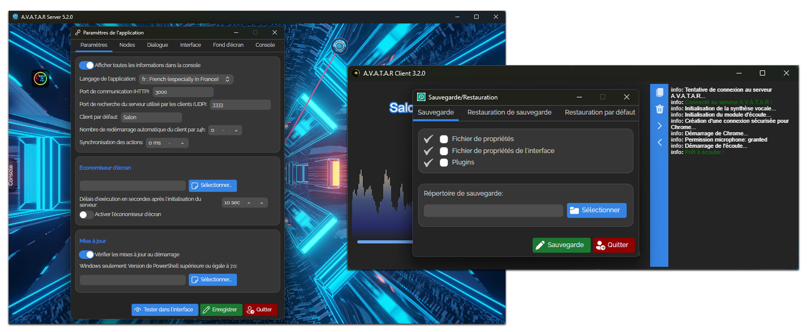
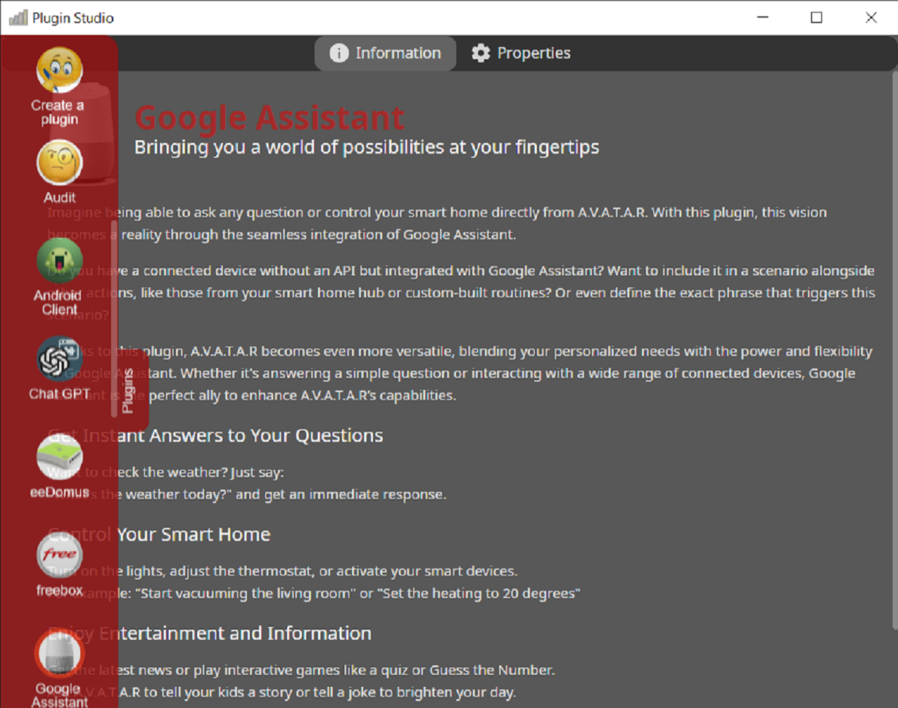
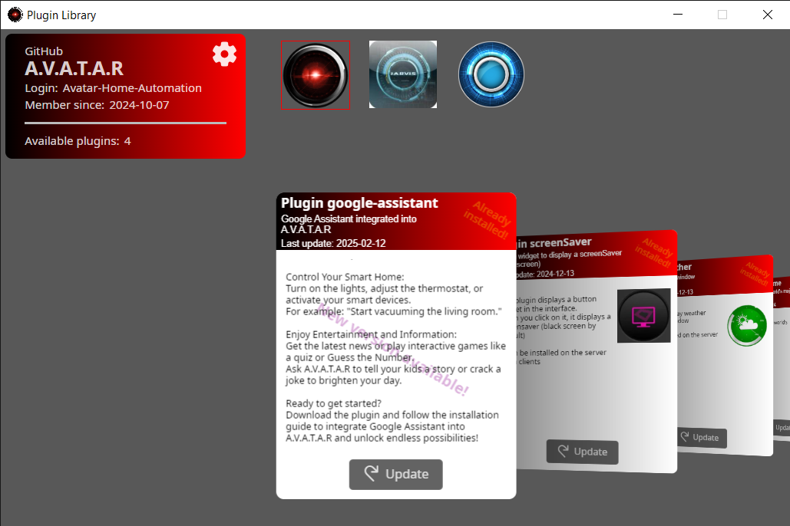
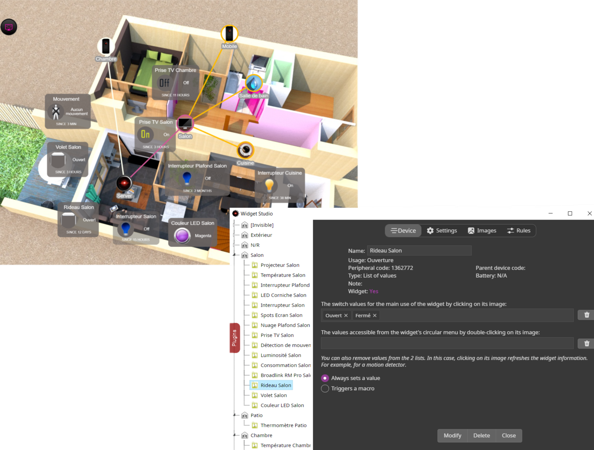

# A.V.A.T.A.R Server

A.V.A.T.A.R is an open source client-server speech recognition assistant dedicated to the design of [intelligent homes](https://en.wikipedia.org/wiki/Home_automation) and the [Internet of Things](https://en.wikipedia.org/wiki/Internet_of_things)

The principle is to dictate a rule via a client, which is sent to the server. The server translates it into English and analyzes it using [Natural Language Processing (NLP)](https://en.wikipedia.org/wiki/Natural_language_processing). If an intention is found, the server triggers the associated script.

These scripts (or plugins) developed in [Node.js](https://nodejs.org/) interact with all connected objects that can be controlled (home automation box, TV box, TV, Wi-Fi speaker, lamp, gadget...), Open Data (TV programs, cinema schedules, world weather, wikipedia...) or even other voice assistants (like Google assistant).

 

<table>
  <tr>
    <td align="center">
       
      <h4>Web Technologies</h4>
      Develop your plugins in Node.js, HTML, and CSS.
    </td>
    <td align="center">
       
      <h4>Cross-platform</h4>
      Compatible with macOS, Windows, and Linux, A.V.A.T.A.R runs on three platforms and supports all architectures supported by Electron.
    </td>
    <td align="center">
       
      <h4>Open Source</h4>
      A.V.A.T.A.R is an open source project with an active community of passionate contributors dedicated to helping you develop interactions with your devices, and share your plugins by becoming a contributor yourself. Join us on Discord!
    </td>
  </tr>
</table>

## Plugin development made easy

A.V.A.T.A.R is the core of your applications, so all you have to do is develop plugins that interact with what you want to manage, and A.V.A.T.A.R takes care of the rest. To this end, A.V.A.T.A.R offers you a development API and a host of tools for easily creating and managing your plugins.  

<table style="width: 100%; table-layout: fixed;">
  <tr>
   <td style="width: 100px; text-align: center; vertical-align: middle;">
      <h3>Plugin Studio</h3>
      Easily create a plugin by choosing a creation template, manage all plugin properties, and update the node.js packages of plugins from Plugin Studio.
    </td>
    <td style="text-align: center;">
       
    </td>
  </tr>
</table>

<table style="width: 100%; table-layout: fixed;">
  <tr>
    <td style="width: 100px; text-align: center; vertical-align: middle;">
      <h3>Plugin Librairy</h3>
      Install a plugin created by contributors into your installation from the plugin library.
    </td>
    <td style="text-align: center; vertical-align: middle;">
       
    </td>
  </tr>
</table>

<table style="width: 100%">
  <tr>
    <td style="width: 100px; text-align: center; vertical-align: middle;">
      <h3>Widget Studio</h3>
      

      If you want to dispense with voice recognition (or using it with), A.V.A.T.A.R also offers a tool for creating and managing button widgets in server and client interfaces to do what you want. These widgets also interact with home automation boxes. 
      

    </td>
    <td style="text-align: center; vertical-align: middle;">
       
    </td>
  </tr>
</table>

 
You can also add your own JS/HTML/CSS to the application to create your own graphical windows.

## Supported platforms

A.V.A.T.A.R client was developed on Windows 10/11, linux (Debian 12) and macOS Sonoma 

* Windows (Windows 10 and up): `ia32 (x86)`, `x64 (amd64)`, `arm64` 
* macOS (Sonoma and up): `64-bit Intel` and `Apple Silicon / ARM binaries` for macOS.	
* linux (Ubuntu, Fedora, Debian): `x64 (amd64)`, `arm64` 
* Raspberry Pi (Raspberry Pi OS): `arm64` 

## Installation

Follow the [installation documentation](https://avatar-home-automation.github.io/docs/)

**Note:** At least, one [A.V.A.T.A.R client](https://github.com/Avatar-Home-Automation/A.V.A.T.A.R-Client) is needed to use the application

## License
Free software under [MIT license](https://github.com/avatar-home-automation/A.V.A.T.A.R-Server/blob/master/LICENSE)
